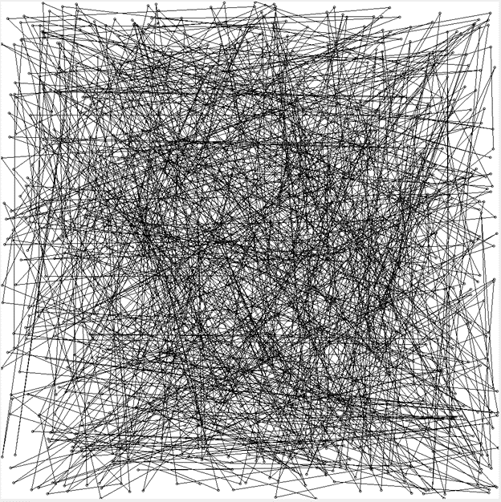
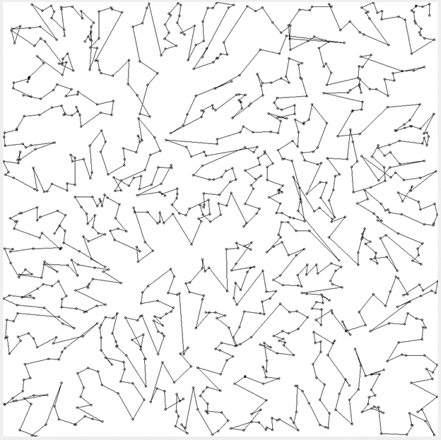

# TravelingSalesmanGeneticAlgorithm

### It's a genetic algorithm for solving the Traveling Salesman problem.  Currently the map display under GenePool.advanceGeneration() and the larger testing loop is commented out, to enable testing on a premade sample.  

## The Chromosomes are stored as ArrayLists of integers
## Chromosome crossover is accomplished by interleaving a pair of chromosomes, then randomly taking one of each integer pair into the first child chromosome, with the others in the second child chromosome.  For example, (1,2,3,4,5) + (1,3,5,2,4) -> (1,1,2,3,3,5,4,2,5,4).  If by chance, the first chromosome took the first of each integer pair, the children would be (1,2,3,5,4), and the second would be (1,3,2,5,4).
## Mutation occurs on children at a 1% rate.  A random integer is moved to a different place in the chromosome.  (1,2,3,4,5) could become (1,3,4,5,2), if the 2 was shifted to the end.

## As earlier mentioned, the programs is set up to run the hardcoded sample 10 times.
### On the sample, the program typically either finds a 19 path or a 20 path. (usually the 19 path, 1,3,2,4,5)

## The program is more impressive when handling larger inputs.  Below is an image of a run on 1000 points, chosen at random.
After random generation of the starting population of 5000, the best path was:

After 4000 generation ~1 hour, the best path:

edit for testing
